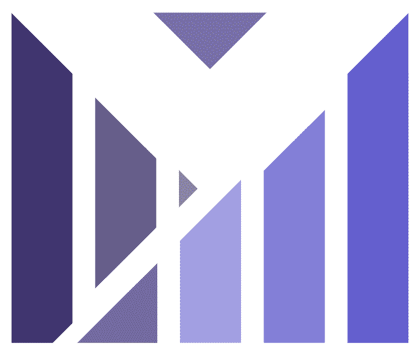

   

  
### SNS 기반 블로그 서비 🖍️

 
    

 

## 📝 목차
- [1. 프로젝트 개요](#1-프로젝트-개요)
- [2. 담당 역할](#2-담당-역할)
- [3. 프로젝트 화면 구성](#3-프로젝트-화면-구성)
- [4. 내가 사용한 기술 스택](#4-사용한-기술-스택)
- [5. 배운점](#5-배운점)
- [6. 회고](#6-회고)

다음과 같은 목차로 구성되어 있습니다.

 

## 🚀 프로젝트 개요
이 프로젝트는 `React, Node, DB설계, aws`를 학습하기 위한 `개인 토이 프로젝트`입니다.  
Velog의 주요 기능을 구현하며 `풀스택 개발`의 기본기를 다지고,  
실제 블로그 플랫폼이 제공하는 사용자 경험을 따라 만들어보는 프로젝트입니다.  
 

## 👨‍💻 담당 역할
💡 **자동 로그아웃 및 연장**
- JWT를 사용한 로그인 처리
- accessToken, refreshToken으로 로그인 연장

💡 **회원 관리**
- 회원가입
- 아이디 찾기
- Gmail API를 통한 비밀번호 인증

💡 **게시물 조회**
- 커버링 인덱스를 통한 페이징 처리

💡 **게시물 쓰기**
- React-quill을 통한 TextEditor 사용
- Multer를 통한 이미지 업로드

💡 **게시물 쓰기**
- 게시물 수정, 삭제
- 댓글 수정, 삭제
- 답글 수정, 삭제

💡 **해시태그**
- 해시태그 별 검색

- 💡 **팔로우**
- 팔로우 관리

- 💡 **히스토리**
- 팔로우 최근 히스토리 

 

 

## 🖥️ 화면 구성
|회원가입|
|:---:|
||
|회원가입 입력값 검증, 프로필 이미지 설정|

 

|게시물 보기|
|:---:|
||
|게시물 페이징 처리| 
 

|게시물 조회, 댓글, 답글, 수정|
|:---:|
||
|React-Quill을 통한 에디터, 댓글, 답글|

 

|팔로우 관리|
|:---:|
||
|팔로우 검색, 팔로우 최근 히스토리 목록, 무한스크롤|

 

|게시물 쓰기|
|:---:|
||
|React-Quill을 통한 게시물 쓰기, Multer 이미지 업로드, 해시태그|

## ⚙ 내가 사용한 기술 스택
### Backend

   
   
   
  
  
  

### Frontend

 
   
   
  
   

### Tools

  

 

## 🤔 배운점
> ### 커넥션 풀
> - `커넥션 풀`을 사용하면 일정량의 Connection 객체를 미리 생성하여 Pool 이라는 공간(캐시)에 저장해둔다
> - [코드 바로보기](https://github.com/qjatjs123123/MyStory/blob/main/db.js#L1-L22)
> - [articles](https://velog.io/@qjatjs123123/%EA%B0%9C%EB%B0%9C-%EC%9D%BC%EC%A7%80-%EA%B2%8C%EC%8B%9C%ED%8C%90%EC%BB%A4%EB%84%A5%EC%85%98-%ED%92%80)
 

> ### Gmail API
> - `nodemailer`를 통한 Gamil API 이메일 전송
> - [코드 바로보기](https://github.com/qjatjs123123/MyStory/blob/main/routes/memberRouter.js#L25-L55)
> - [articles](https://velog.io/@qjatjs123123/%EA%B0%9C%EB%B0%9C-%EC%9D%BC%EC%A7%80-%EA%B2%8C%EC%8B%9C%ED%8C%90Gmail-API)
 

> ### 이메일을 통한 본인 인증 방법
> 
> 
> - `악보공장` 웹 서비스의 이메일 인증 방식 구현
> - 비밀번호 찾기 시 본인 인증을 위해 이메일 인증을 진행하였습니다.
> - [코드 바로보기](https://github.com/qjatjs123123/MyStory/blob/main/routes/memberRouter.js#L57-L67)
> - [articles](https://velog.io/@qjatjs123123/%EA%B0%9C%EB%B0%9C-%EC%9D%BC%EC%A7%80-%EA%B2%8C%EC%8B%9C%ED%8C%90%EC%9D%B4%EB%A9%94%EC%9D%BC-%EC%9D%B8%EC%A6%9D)
 

> ### 민감한 데이터 암호화
> - `Bcrypt`를 통한 데이터 암호 
> - DB에 개인정보 암호화하여 저장
> - <a href="https://github.com/qjatjs123123/MyStory/blob/main/routes/memberRouter.js#L222-L234" target="_blank">코드 바로보기</a>
> - <a href="https://velog.io/@qjatjs123123/%EA%B0%9C%EB%B0%9C-%EC%9D%BC%EC%A7%80-%EA%B2%8C%EC%8B%9C%ED%8C%90Bcrypt" target="_blank">articles</a>
 

> ### jwt
> - `jwt`를 통한 로그인 처리
> - `jwt`와 `session` 차이
> - `accessToken`과 `refreshToken`으로 로그인 연장
> - [코드 바로보기](https://github.com/qjatjs123123/MyStory/blob/main/routes/memberRouter.js#L121-L186)
> - [articles](https://velog.io/@qjatjs123123/%EA%B0%9C%EB%B0%9C-%EC%9D%BC%EC%A7%80-%EA%B2%8C%EC%8B%9C%ED%8C%90jwt)
 

> ### Cookie-parser
> - 클라이언트에서 서버로 요청을 보낼 때 쿠키를 포함
> - 서버에서 쿠키를 `cookie-parser`로 파싱하여 처리
> - `refreshToken` cookie값 parser하기
> - [코드 바로보기](https://github.com/qjatjs123123/MyStory/blob/main/routes/memberRouter.js#L165-L167)
> - [articles](https://velog.io/@qjatjs123123/%EA%B0%9C%EB%B0%9C-%EC%9D%BC%EC%A7%80-%EA%B2%8C%EC%8B%9C%ED%8C%90cookie-parser)
 

## 📲 링크
| :: 시연                                                            |
| :------------------------------------------------------------------------------------- |
| :: [Youtube Link](https://youtu.be/TyQVO3QFEDo?si=9lLZNdxKwd-Ec96k) | 

